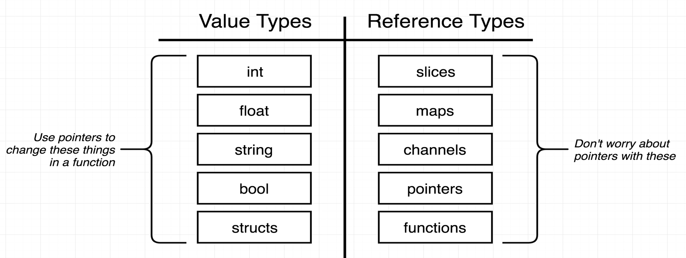
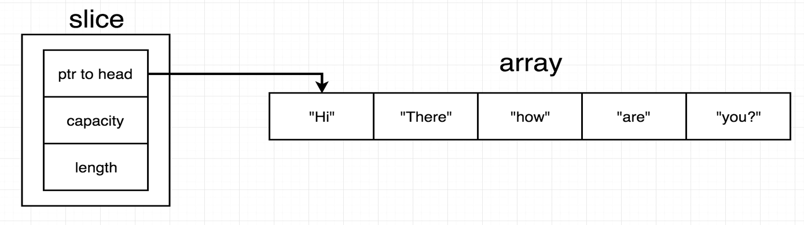
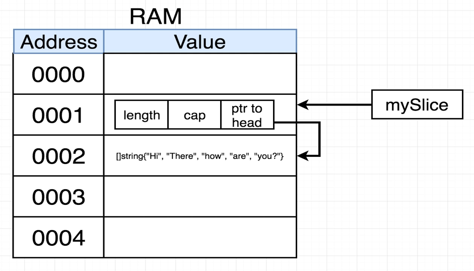
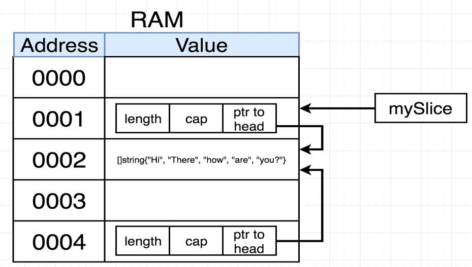

### Run go 

Build and execute go code.

```sh
go run [file]
```
### Package

Its like a workspace.

Executable type: generates a file that we can run.
Main is used for executable package.
Go build generates main file that is runnable.

Reusable type: code used as 'helpers', good for reusable logic.

### Var declaration

```go
var card string = "Ace of Spades"
card1 := "Ace of Spades" // short init
card1 = "Five of Diamonds"
```

### Custom types

```go
type deck []string
```

### Types



### Structs

Collection of properties that are related.

```go
type person struct {
	firstName string
	lastName string
}

john := person{"John", "Doe"}

// Best approach
john := person{firstName: "John", lastName: "Doe"}

fmt.Printf("%+v", john)
```
Struct within struct:

```go
type contactInfo struct {
	email   string
	zipCode int
}

type person struct {
	firstName string
	lastName  string
	contact   contactInfo
}

jim := person{
		firstName: "Jim",
		lastName:  "Doe",
		contact: contactInfo{
			email:   "jimdoe@mail.com",
			zipCode: 12345,
		},
	}
```

### Array X Slice

Array in go have fixed lenght, while slice can grow or shrink.

Slices element must be of same type.

```go
cards := []string{"Ace of Diamonds", "Five of Spades"} // slice declaration

cards = append(cards, "Ace of Spades") // adding element to slice, append creates a new slice

for i, card := range cards { // iterate in cards
	fmt.Println(i, card)
}
```

Under the hood, every slice contains an array: 





So, this is the why when you create a receiver function to an slice, you dont need use pointers, the copy created during the function runtime points to the same address of slice inner array:



Dividing slice:

`slice[startIndexIncluding:upToNotIncluded]` 

Both values can be omited, so go will infer start and end of slice.

```go

fruits = []string{"Apple", "Banana", "Grape", "Orange"}

fmt.Println(fruits[0:2])

```

### Receiver functions

```go
func (d deck) print() {}
```

Any variable of type deck now access print method.

Use the first letter for name reference, like `d`.

But, as go is a passing value language, when the receiver function its called, its generate a copy by value of the original structure, for example:

```go
type person struct {
	firstName string
}

func (p person) updateName(newName string) {
	p.firstName = newName
}
```

If you call updateName, the original variable does not change, because updateName create a copy of person and then change this copy.

```go
jim := person{
	firstName: "Jim",
}
jim.updateName("Jimmy")

// jim.firstName still as Jim
```

To fix this, use pointers:

### Pointers

For change slices, there is no need of pointes.

`&var` gives access to memory address

`*pointer` gives access to value that memory address point

A * before a *type*, means that we're working with a pointer of this type, like `*person` means that pointerToPerson is a pointer of a person struct.

While * before a *var*, indicates that we want manipulate the value the pointer is referencing, so we're accessing `*pointerToPerson` value

```go
func (pointerToPerson *person) updateName(newName string) {
	(*pointerToPerson).firstName = newName
}
```

But there is a short hand, you can declare you function receveing a pointer, but you dont need to create a pointer from a variable, like: 

```go
jimPointer := &jim
jimPointer.updateName("Jimmy")
```

You can use just:

```go
jim.updateName("Jimmy")
```

### Multiple returning value from functions

The `(deck, deck)` represent that this function return 2 variables of deck type.

```go
// method declare
func deal(d deck, handSize int) (deck, deck) {
	return d[:handSize], d[handSize:]
}

// retriving the values
hand, remainingDeck := deal(cards, 5)
```

### Interfaces


### Random

Go `math` methods that generate random numbers, always return the same values.
Go use the same seed for generate these values, so every time its necessary to change the seed value.

### Testing

Create a new file:

`file_test.go`

Run tests with

```sh
go test
```